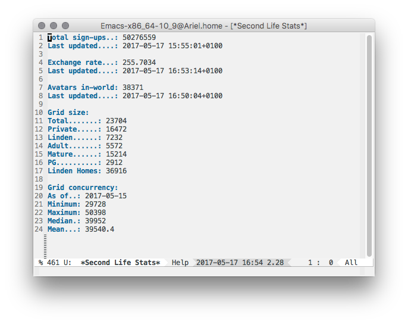
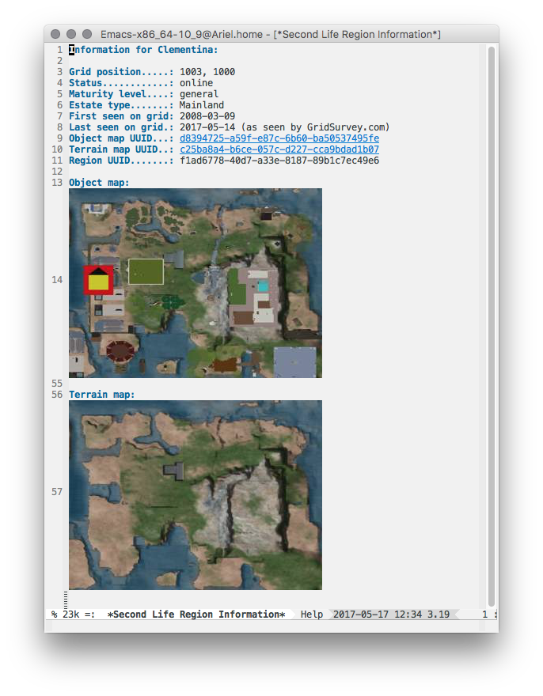

# slstats.el

Acquire and display stats about Second Life

## Commentary:

`slstats.sl` provides commands that make it easy to load and view the basic
stats about the [Second Life](http://secondlife.com/) grid
and [its economy](http://gridsurvey.com/economy.php). Included commands are:

`slstats-signups` - Displays the sign-up total.

`slstats-exchange-rate` - Displays the most recent L$ -> $ exchange rate.

`slstats-inworld` - Displays how many avatars are in-world.

`slstats-grid-size` - Displays stats about the size of the Second Life grid.

`slstats` - Opens a window and displays all the above. The result looks
something like this:

`slstats-region-info` - Prompts for a Second Life region name and displays
information about it in a window.

